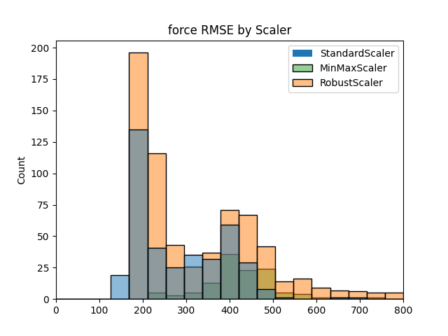

## FSR Data Prediction

This is a neural network learning project aimed at obtaining accurate results without the need for expensive equipment when measuring the pressure applied to the soles of the feet in various situations. It allows obtaining results measured through F-Scan using 6 FSR sensors.

Ref: https://www.mdpi.com/1424-8220/18/12/4349

## Structure

name          | information
--------------|------------
data          | preprocessed data
eda           | data eda
fsr_data      | data loading process
fsr_model     | deep learning model (implemented pytorch)
fsr_trainable | training process (implemented ray)
task*         | hyper parameter tuning process

## Tuning Result

https://wandb.ai/seokjin/FSR-prediction?workspace=user-seokjin

## Result Summary

### predict force RMSE

model   |  task1|  task2|  task4|  task5
--------|------:|------:|------:|------:
ANN     |200.373|200.127|177.361|184.365
CNN-LSTM|203.214|178.705|171.708|175.383
LSTM    |192.334|155.939|179.106|188.688

### predict coord RMSE

model   |  task1|  task3|  task4|  task6
--------|------:|------:|------:|------:
ANN     |  0.943| 0.6551|  0.974| 0.6716
CNN-LSTM|  0.927| 0.5428|  1.022| 0.6782
LSTM    |  0.901| 0.5864|  1.005| 0.6762

### simulation result

<p align='middle'>
  
  
  
  
</p>

### hyperparameter tuning result

<p align='middle'>
  
  
  
</p>

## Environment

Windows10 22H2

WSL Ubuntu 22.04.2

python 3.10.12

torch 2.0.1

ray[all] 2.5

## Use Wandb

```
pip install wandb
wandb login
```

add `ray.air.integrations.wandb.WandbLoggerCallback` to `ray.tune.Tuner`

## Use Memory Monitor

### Setup Prometheus

recommended to download latest version

```
wget https://github.com/prometheus/prometheus/releases/download/v2.45.0/prometheus-2.45.0.linux-amd64.tar.gz
tar xvfz prometheus-2.45.0.linux-amd64.tar.gz
cd prometheus-2.45.0.linux-amd64
./prometheus --config.file=/tmp/ray/session_latest/metrics/prometheus/prometheus.yml
```
[prometheus reference](https://prometheus.io/download/)

[ray reference](https://docs.ray.io/en/latest/cluster/metrics.html#setting-up-your-prometheus-server)

### Setup Grafana

```
wget https://dl.grafana.com/enterprise/release/grafana-enterprise-10.0.1.linux-amd64.tar.gz
tar -zxvf grafana-enterprise-10.0.1.linux-amd64.tar.gz
cd grafana-10.0.1
./bin/grafana-server --config /tmp/ray/session_latest/metrics/grafana/grafana.ini web
```

[grafana reference](https://grafana.com/grafana/download)

[ray reference](https://grafana.com/grafana/download)

give authentication: [here](https://docs.ray.io/en/latest/cluster/configure-manage-dashboard.html#user-authentication-for-grafana)

if first grafana login, user name and password should be entered as 'admin' each.